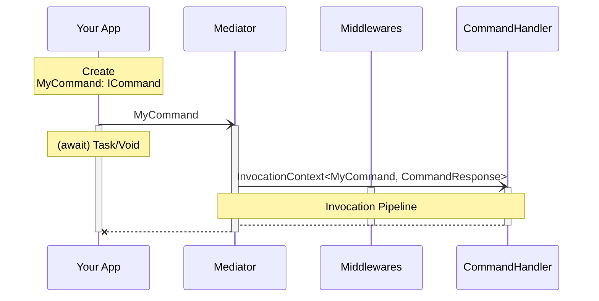

***

```mermaid
sequenceDiagram

    participant App as Your App

    participant Mediator as Mediator
    participant Middlewares as Middlewares
    participant Handler as CommandHandler

    Note over App: Create<br/>MyCommand: ICommand
    App-)Mediator: MyCommand
    activate App
    activate Mediator
    Note over App: (await) Task/Void
    Mediator-)Handler: InvocationContext<MyCommand, CommandResponse>
    activate Handler
    activate Middlewares
    Note over Mediator,Handler: Invocation Pipeline
    Handler-->Mediator: 
    deactivate Middlewares
    deactivate Handler
    Mediator--xApp: 
    deactivate Mediator
    deactivate App
```

### Example

[!INCLUDE [example](../Fragments/command-example.md)]
