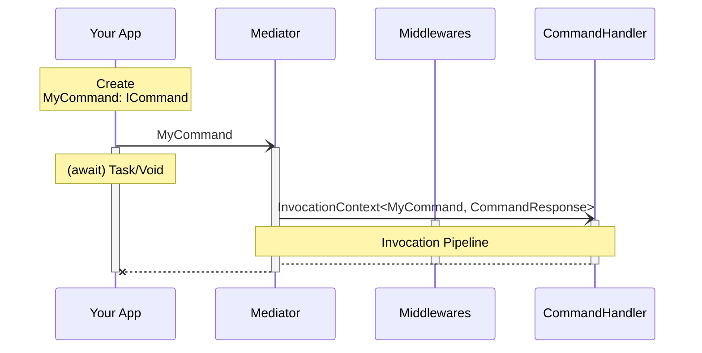

The namespace <xref:Crucible.Mediator.Commands> includes classes and interfaces
to handle the mediator event use case with <xref:Crucible.Mediator.Commands.ICommand> 
as contract and <xref:Crucible.Mediator.Commands.CommandHandler`1> as handler.

Commands represent actions or operations that trigger 
state changes in the system that do not require a response 
or result, such as creating, updating, or deleting data.

---
uid: Crucible.Mediator.Commands
---

***

### Example

[!INCLUDE [example](../Fragments/command-example.md)]
