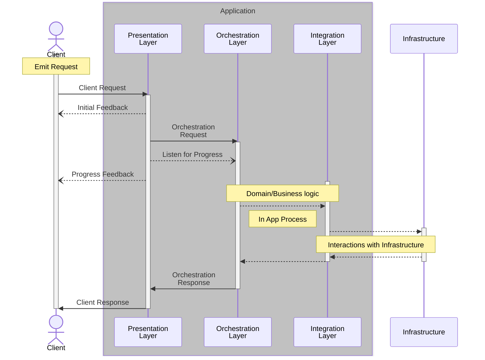

# Concept

```mermaid
sequenceDiagram

    actor Client as Client

    box rgba(0,0,0,0.2) Application<br/>
        participant Presentation as Presentation<br/>Layer
        participant Orchestration as Orchestration<br/>Layer
        participant Integration as Integration<br/>Layer
    end

    participant Infrastructure as Infrastructure
    
    activate Client
    Note over Client: Emit Request
    Client->>Presentation: Client Request
    activate Presentation
    Presentation--)Client: Initial Feedback
    Presentation->>Orchestration: Orchestration<br/>Request
    activate Orchestration
    Presentation--)Orchestration: Listen for Progress
    Presentation--)Client: Progress Feedback
    activate Integration
    Note over Orchestration,Integration: Domain/Business logic
    Orchestration-->>Integration: 
    Note right of Orchestration: In App Process
    activate Infrastructure
    Integration-->>Infrastructure: 
    Note over Integration,Infrastructure: Interactions with Infrastructure
    Infrastructure-->>Integration: 
    Integration-->>Orchestration:  
    deactivate Infrastructure
    deactivate Integration
    Orchestration->>Presentation: Orchestration<br/>Response
    deactivate Orchestration
    Presentation->>Client: Client Response
    deactivate Presentation
    deactivate Client
```