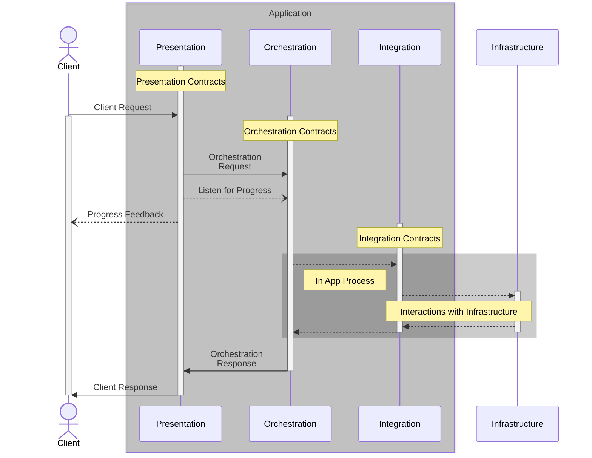
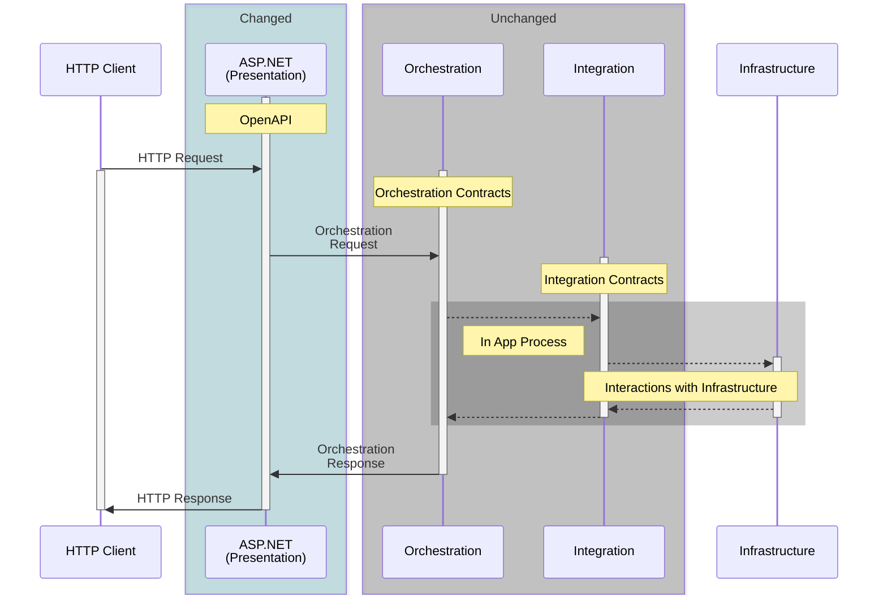
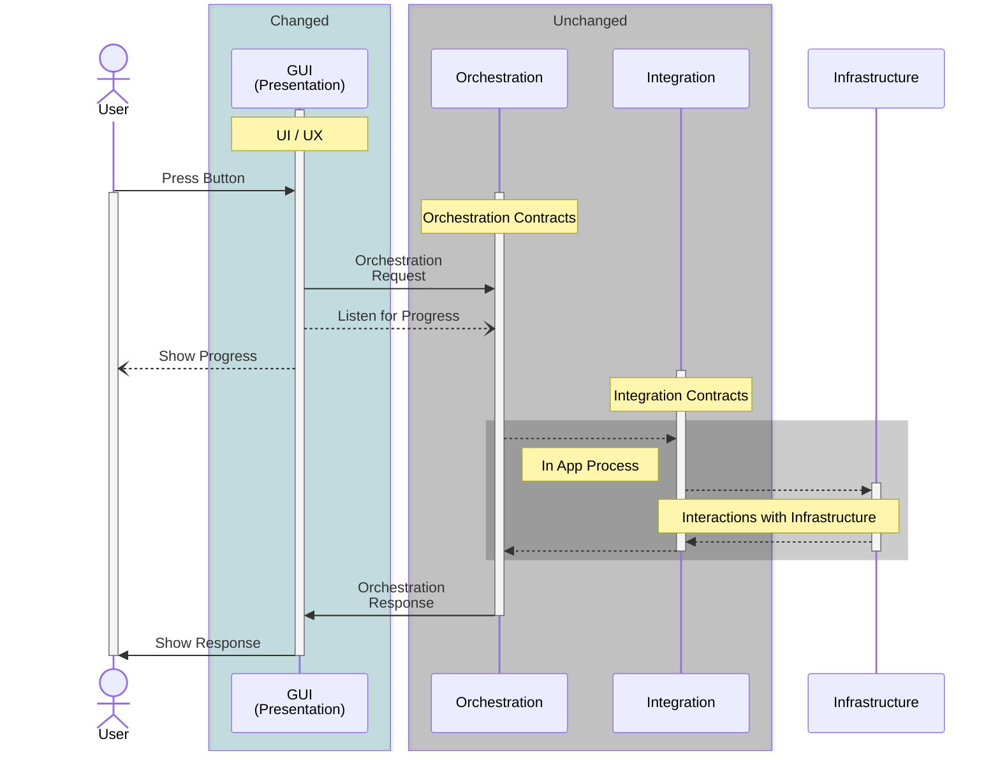
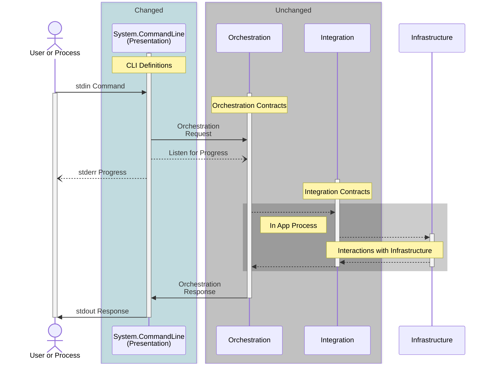

# Introduction

```mermaid
sequenceDiagram

    actor Client as Client

    box rgba(0,0,0,0.2) Application<br/>
        participant Presentation as Presentation
        participant Orchestration as Orchestration
        participant Integration as Integration
    end

    participant Infrastructure as Infrastructure
    
    activate Presentation
    Note over Presentation: Presentation Contracts
    Client->>Presentation: Client Request
    activate Client
    activate Orchestration
    Note over Orchestration: Orchestration Contracts
    Presentation->>Orchestration: Orchestration<br/>Request
    Presentation--)Orchestration: Listen for Progress
    Presentation--)Client: Progress Feedback
    activate Integration
    Note over Integration: Integration Contracts
    rect rgba(0,0,0,0.2)
        Orchestration-->>Integration: 
        Note right of Orchestration: In App Process
        activate Infrastructure
        Integration-->>Infrastructure: 
        Note over Integration,Infrastructure: Interactions with Infrastructure
        Infrastructure-->>Integration: 
        Integration-->>Orchestration:  
        deactivate Infrastructure
        deactivate Integration
    end
    Orchestration->>Presentation: Orchestration<br/>Response
    deactivate Orchestration
    Presentation->>Client: Client Response
    deactivate Presentation
    deactivate Client
```

```mermaid
sequenceDiagram

    participant Client as HTTP Client

    box rgba(0,128,150,0.2) Changed<br/>
        participant Presentation as ASP.NET<br/>(Presentation)
    end

    box rgba(0,0,0,0.2) Unchanged<br/>
        participant Orchestration as Orchestration
        participant Integration as Integration
    end

    participant Infrastructure as Infrastructure
    
    activate Presentation
    Note over Presentation: OpenAPI
    Client->>Presentation: HTTP Request
    activate Client
    activate Orchestration
    Note over Orchestration: Orchestration Contracts
    Presentation->>Orchestration: Orchestration<br/>Request
    activate Integration
    Note over Integration: Integration Contracts
    rect rgba(0,0,0,0.2)
        Orchestration-->>Integration: 
        Note right of Orchestration: In App Process
        activate Infrastructure
        Integration-->>Infrastructure: 
        Note over Integration,Infrastructure: Interactions with Infrastructure
        Infrastructure-->>Integration: 
        Integration-->>Orchestration:  
        deactivate Infrastructure
        deactivate Integration
    end
    Orchestration->>Presentation: Orchestration<br/>Response
    deactivate Orchestration
    Presentation->>Client: HTTP Response
    deactivate Presentation
    deactivate Client
```

```mermaid
sequenceDiagram

    actor Client as User
    
    box rgba(0,128,150,0.2) Changed<br/>
        participant Presentation as GUI<br/>(Presentation)
    end

    box rgba(0,0,0,0.2) Unchanged<br/>
        participant Orchestration as Orchestration
        participant Integration as Integration
    end

    participant Infrastructure as Infrastructure
    
    activate Presentation
    Note over Presentation: UI / UX
    Client->>Presentation: Press Button
    activate Client
    activate Orchestration
    Note over Orchestration: Orchestration Contracts
    Presentation->>Orchestration: Orchestration<br/>Request
    Presentation--)Orchestration: Listen for Progress
    Presentation--)Client: Show Progress
    activate Integration
    Note over Integration: Integration Contracts
    rect rgba(0,0,0,0.2)
        Orchestration-->>Integration: 
        Note right of Orchestration: In App Process
        activate Infrastructure
        Integration-->>Infrastructure: 
        Note over Integration,Infrastructure: Interactions with Infrastructure
        Infrastructure-->>Integration: 
        Integration-->>Orchestration:  
        deactivate Infrastructure
        deactivate Integration
    end
    Orchestration->>Presentation: Orchestration<br/>Response
    deactivate Orchestration
    Presentation->>Client: Show Response
    deactivate Presentation
    deactivate Client
```

```mermaid
sequenceDiagram

    actor Client as User or Process
    
    box rgba(0,128,150,0.2) Changed<br/>
        participant Presentation as System.CommandLine<br/>(Presentation)
    end

    box rgba(0,0,0,0.2) Unchanged<br/>
        participant Orchestration as Orchestration
        participant Integration as Integration
    end

    participant Infrastructure as Infrastructure
    
    activate Presentation
    Note over Presentation: CLI Definitions
    Client->>Presentation: stdin Command
    activate Client
    activate Orchestration
    Note over Orchestration: Orchestration Contracts
    Presentation->>Orchestration: Orchestration<br/>Request
    Presentation--)Orchestration: Listen for Progress
    Presentation--)Client: stderr Progress
    activate Integration
    Note over Integration: Integration Contracts
    rect rgba(0,0,0,0.2)
        Orchestration-->>Integration: 
        Note right of Orchestration: In App Process
        activate Infrastructure
        Integration-->>Infrastructure: 
        Note over Integration,Infrastructure: Interactions with Infrastructure
        Infrastructure-->>Integration: 
        Integration-->>Orchestration:  
        deactivate Infrastructure
        deactivate Integration
    end
    Orchestration->>Presentation: Orchestration<br/>Response
    deactivate Orchestration
    Presentation->>Client: stdout Response
    deactivate Presentation
    deactivate Client
```